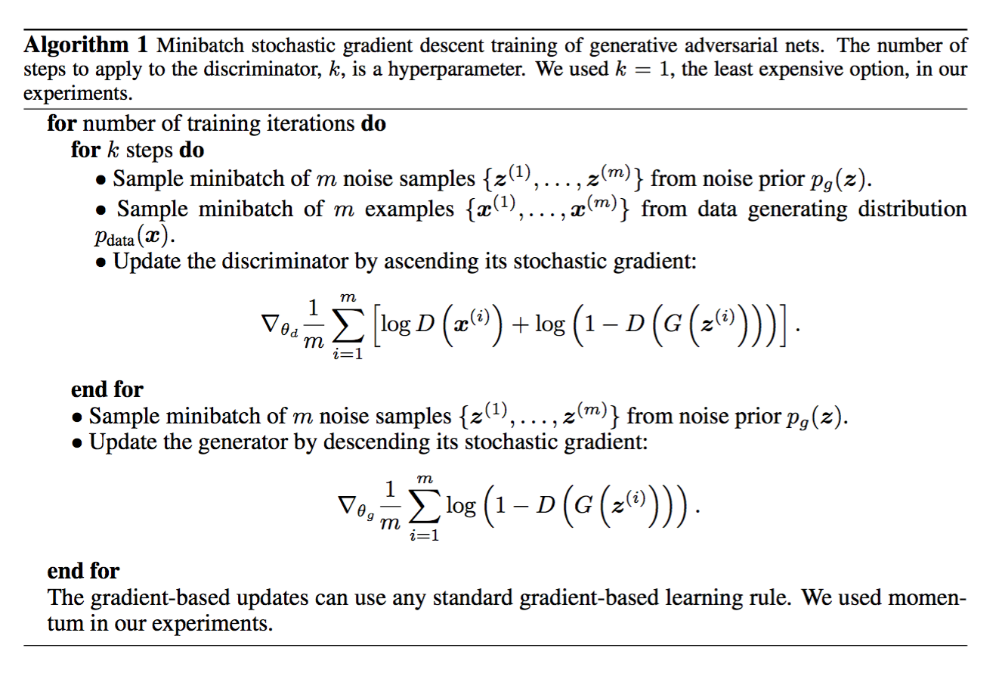
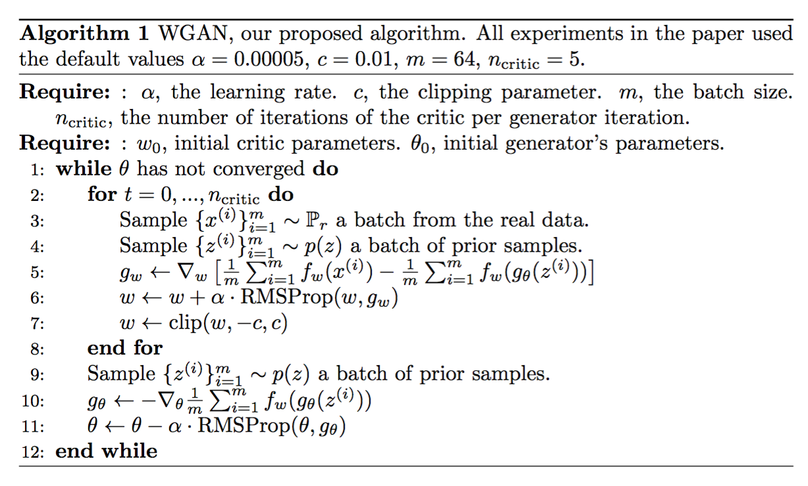
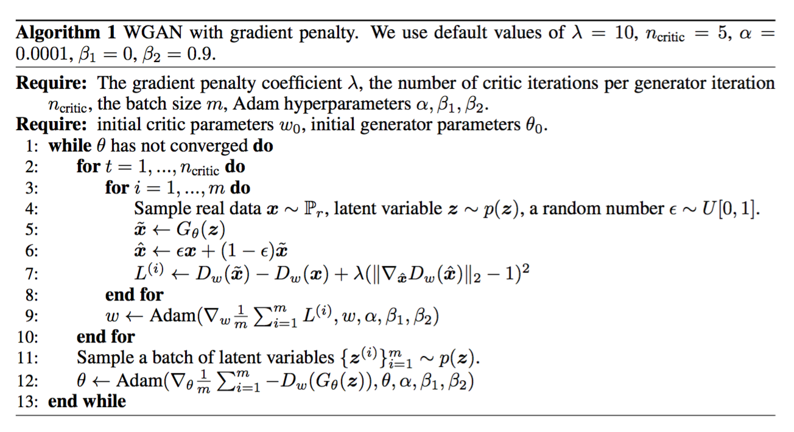
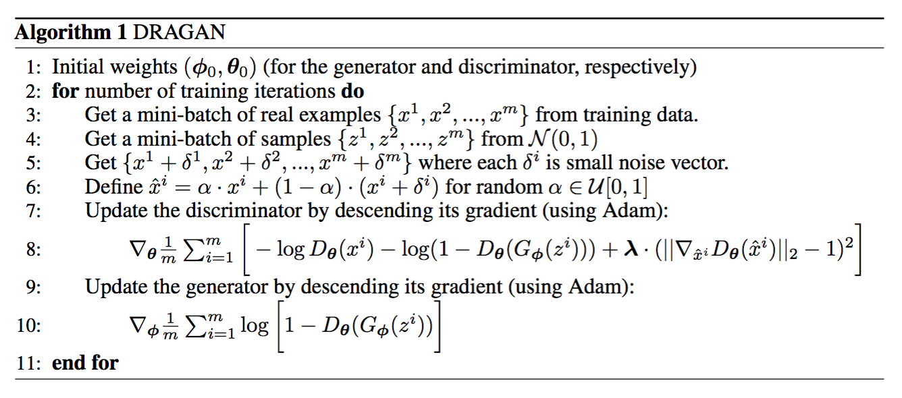
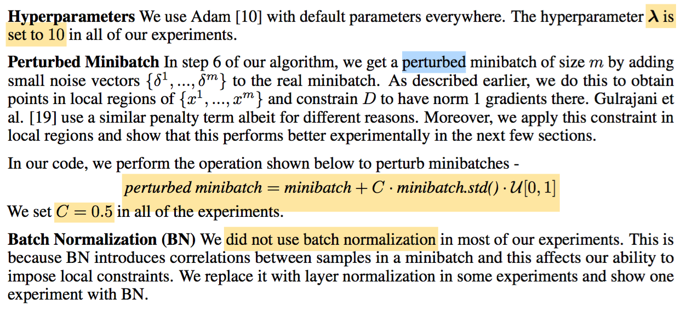

## 训练GANs一年我学到的10个教训
参考《训练GANs一年我学到的10个教训 - 知乎.pdf》

感觉：7标签平滑、8多尺度梯度、9设置不同学习率，可能有用

## GAN

$$
V(D,G)=E_{x \sim p_{data}(x)}[log D(x)] + E_{z \sim p_z(z)}[log(1-D(G(z)))] \tag1
$$

目标就是：
$$
\underset{G}{min} ~ \underset{D}{max} ~ V(D,G)
$$

### 全局最优解 $p_g=p_{data}$

$$
\begin{align}
V(D,G)&=\int_x p_{data}(x)log(D(x))dx + \int_z p_z(z)log(1-D(g(z)))dz \\
&=\int_x p_{data}(x)log(D(x))+p_g(x)log(1-D(x))dx
\end{align}
$$

对于任意的$(a,b) \in \mathcal{R}^2 \backslash \{0,0\}$, $y=a\ log(y)+b\ log(1-y)$在$a \over {a+b}$处取得最大值

因此最优discriminator D为：
$$
D_G^*(x)={p_{data}(x) \over {p_{data}(x)+p_g(x)}}
$$

于是

$$
\begin{align}
C(G)&=\underset{D}{max} V(G,D) \\
&=E_{x \sim p_{data}}[logD_G^*(x)]+E_{z \sim p_g}[log(1-D_G^*(G(z)))] \\
&=E_{x \sim p_{data}}[logD_G^*(x)]+E_{x \sim p_g}[log(1-D_G^*(x))] \\
&=E_{x \sim p_{data}} \left[ log{ p_{data}(x) \over p_{data}(x)+p_g(x) } \right] + E_{x \sim p_g} \left[ log{ p_g(x) \over p_{data}(x)+p_g(x) } \right] \\
&=-log(4)+ KL \left( p_{data} \parallel {p_{data}+p_g \over 2} \right) + KL \left( p_g \parallel {p_{data}+p_g \over 2} \right) \\
&=-log(4)+2 \cdot JSD(p_{data} \parallel p_g) \\
& \geq -log(4)
\end{align}
$$

KL is the Kullback–Leibler divergence, JSD is Jensen Shannon divergence

当$p_{data}=p_g$时，$C(G)$取最小值$-log(4)$

为理解$JSD \geq 0$，举个例子，$对KL \left( p_g \parallel {p_{data}+p_g \over 2} \right)，p_g固定为0.1，P_{data}取两个不同值0.09、0.11得：$
$$
\begin{align}
&0.1 \cdot log{0.2 \over 0.1 + 0.09} + 0.1 \cdot log{0.2 \over 0.1 + 0.11} \\
&=0.1 \cdot log \left({2 \over 1 + 0.9} \cdot {2 \over 1 + 1.1}\right) \\
&=0.1 \cdot log {4 \over 1.9 \cdot 2.1} \\
&=0.1 \cdot log {4 \over 3.99} \\
&\geq 0
\end{align}
$$

## DCGAN

稳定训练准则：

1. Use all convolutional networks which learn their own spatial downsampling (discriminator) or upsampling (generator)
2. Remove fully connected hidden layers for deeper architectures
3. Use batch normalization in both the generator and the discriminator
4. Use ReLU activation in the generator for all layers except the output layer, which uses tanh
5. Use LeakyReLU activation in the discriminator for all layers

## Wasserstein GAN

$$
\begin{align}
W(P_r, P_\theta)&=\underset{\gamma \in \Pi(P_r,P_g) }{inf} E_{(x,y) \sim \gamma}\left[\parallel x-y \parallel \right] \\
&=\underset{\parallel f \parallel_L \leq 1}{sup} E_{x \sim P_r}[f(x)] - E_{x \sim P_\theta}[f(x)]
\end{align}
$$

$W(P_r, P_\theta)$就是Earth-Mover(EM)距离

算法第一步更新$w$使得$f_w(x)-f_\theta(x)$不断靠近最大值（梯度上升），而这个最大值就是EM距离$W(P_r, P_\theta)$。可以想象成调整超平面倾斜程度，使得斜率为1

算法第二步，针对$\theta$参数求EM距离最小值（梯度下降），其中$f_w(x)$与$\theta$无关，求导时为0，$-f_\theta(x)$求导后梯度下降更新$\theta$。可以想象成在超平面上，拉近generator生成的点与原数据集中的点的距离

## Wasserstein GAN with GP

## InfoGAN

参考：InfoGAN介绍.htm

如果从表征学习的角度来看GAN模型，会发现，由于在生成器使用噪声z的时候没有加任何的限制，所以在以一种高度混合的方式使用z，z的任何一个维度都没有明显的表示一个特征，所以在数据生成过程中，我们无法得知什么样的噪声z可以用来生成数字1，什么样的噪声z可以用来生成数字3

### 互信息最大化

我们可以把互信息看成当观测到y值而造成的x的不确定性的减小。如果x，y是相互独立没有相关性，即互信息的值为0，那么已知y值的情况下推测x与x的原始分布没有区别；如果x，y有相关性，即互信息的值大于0，那么已知y值的情况下，我们就能知道哪些x的值出现的概率更大。

the information in the latent code $c$ should not be lost in the generation process

作者最终用$Q(c,x)$来近似条件概率分布$p(C=c|X=x)$，并最终转化为最大化$E_{c \sim p(C),z \sim p_z(Z), x=G(z,c)}[ln Q(c,x)]$

### 个人理解：

从sugartensor的example：mnist_info_gan.py来看，从D网络最后一层卷积共享输出层连接一层dense输出c，意味着特征可以通过linear线性方式复原为原先的c，说明：一方面c在G网络生成图像时未丢失，另一方面c是一种线性表征，容易分离出各自维度的独立特征而互不干扰

## VAE - Variational Autoencoder

参考代码：

`https://github.com/vaxin/TensorFlow-Examples/blob/master/examples/3_NeuralNetworks/variational_autoencoder.py`

真实图像数据集X，encoder网络以X为输入，输出z的分布参数：mu和sigma，从这个分布中采样得到一批z，要求z符合N(0,I)正态分布。
然后以z为输入，用decoder网络得到X'，X与X'最小化mse

连续性，latent space中两个相邻的点应该被decode成相似或者同样的内容
完整性，从latent space中抽样出一个点应该被decode成有意义的内容

更多参考：https://zhuanlan.zhihu.com/p/495877502?utm_id=0

## DRAGAN

