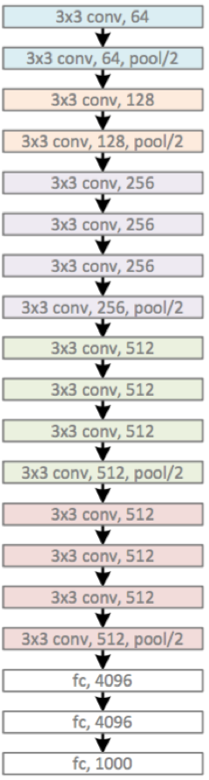
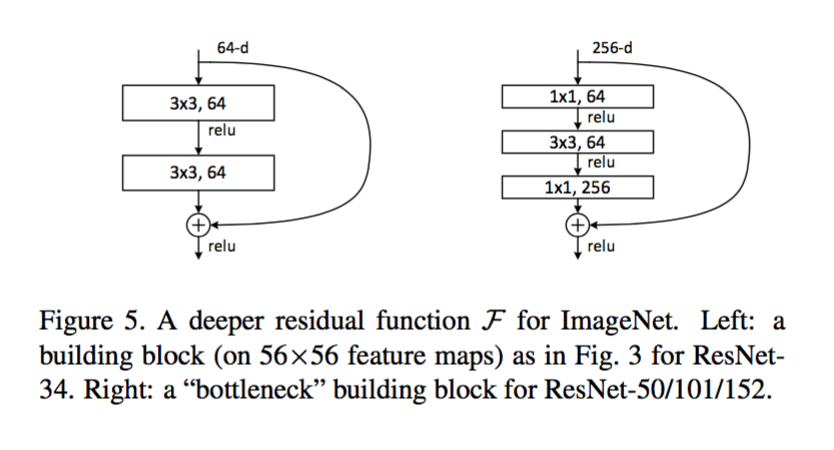
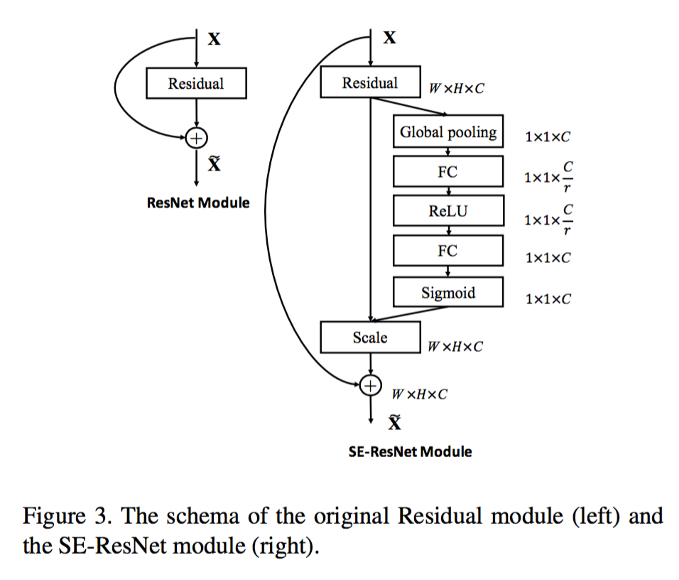

## 总结

### inception v1 - Going Deeper with Convolutions

http://www.jianshu.com/p/a2ad00eddbd5

1. 提出inception architecture并对其优化
2. 取消全连层
3. 运用auxiliary classifiers加速网络converge

inception architecture: 我自己对“稀疏连接结构”的理解是这样的，用尽可能的“小”、“分散”的可堆叠的网络结构，去学习复杂的分类任务，怎么体现“小”、“分散”呢？如下图：


在一层网络中存在多个不同尺度的kernels，每一个尺度的kernel会学习不同的特征，把这些不同kernels学习到的特征汇聚给下一层

#### 1x1 Conv**，防止Concatenation维度爆炸

利用1x1 Conv将深度降低后，再3x3 Conv，最后concatenate起来


auxiliary classifiers，防止梯度消散，加速网络converge


### inception v3 - Rethinking the Inception Architecture for Computer Vision

http://www.jianshu.com/p/0cc42b8e6d25

1. 分解大filters，使其小型化、多层化，其中有个“非对称卷积”很新颖
2. 优化inception v1的auxiliary classifiers
3. 提出一种缩小特征图大小的方法，说白了就是一种新的、更复杂的pooling层
4. Label smooth，“标签平滑”，很难用中文说清楚的一种方法

Szegedy还把一段时间内的科研心得总结了一下，在论文里写了4项网络设计基本原则:

1. 尽量避免representational bottlenecks，这种情况一般发生在pooling层，字面意思是，pooling后特征图变小了，但有用信息不能丢，不能因为网络的漏斗形结构而产生表达瓶颈，解决办法是上面提到的贡献3

#### Label smooth

Intuitively, this happens because the model becomes too confident about its predictions

我想起来一个美国签证官曾经跟我说过的话：“他看学术论文的时候，每个单词都认识，但所有单词拼到一起的时候，就蒙圈了。”

```python
new_labels = (1.0 - label_smoothing) * one_hot_labels + label_smoothing / num_classes
```

Szegedy在网络实现的时候，令 label_smoothing = 0.1，num_classes = 1000。Label smooth提高了网络精度0.2%。


## cnn-benchmarks

https://github.com/jcjohnson/cnn-benchmarks

## VGG




## Inception

https://www.zhihu.com/question/50370954


<br>
<br>
<br>
<br>
<br>

<br>
<br>
<br>
<br>
<br>


## ResNet




we use a stack of 3 layers instead of 2 (Fig. 5). The three layers are 1×1, 3×3, and 1×1 convolutions, where the 1×1 layers are responsible for reducing and then increasing (restoring) dimensions, leaving the 3×3 layer a bottleneck with smaller input/output dimensions

## ResNet v2


## ResNeXt

网络拆分，4个channel一组（Cardinality），提高了网络的分工和局部适应性，增大Cardinality比增大模型的width或者depth效果更好


下面几种形式等价：

- a为分割path形式
- b提前做了加法（concatenate）
- c通过 Group Conv 实现与 a、b等价的效果


## DenseNet


## Dual Path Net


## SENet

Squeeze-and-Excitation Networks

将channel加权求和，权重通过一个小的神经网络给出





## MobileNet

MobileNet模型的核心就是将原本标准的卷积操作因式分解成一个depthwise convolution和一个1*1的卷积（文中叫pointwise convolution）操作。简单讲就是将原来一个卷积层分成两个卷积层，其中前面一个卷积层的每个filter都只跟input的每个channel进行卷积，然后后面一个卷积层则负责combining，即将上一层卷积的结果进行合并


## MobileNet_v2


