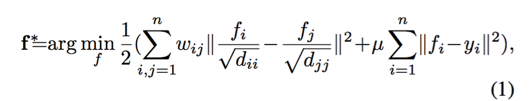
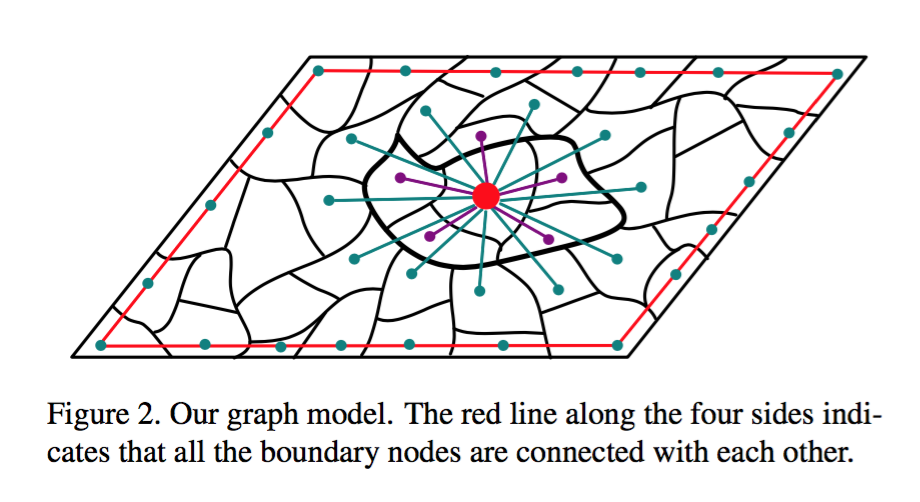
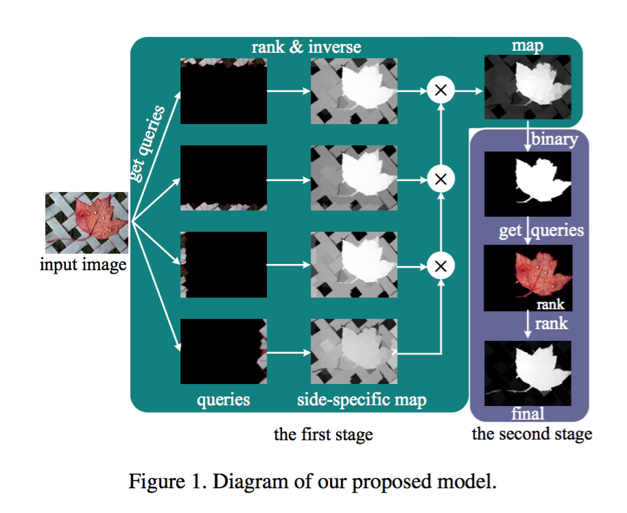

参考论文《Saliency Detection via Graph-Based Manifold Ranking》

代码：`https://github.com/ruanxiang/mr_saliency`

### 基本思路

一般图像的四条边区域与背景更接近，人眼的关注点一般位于图像正中位置，基于这个假设，计算图像内容与四条边的接近程度，选取出差别大的区域，作为Saliency区域

### 目标函数

第一项为smoothness constraint，第二项为fitting constraint：a good ranking function should not change too much between nearby points (smoothness constraint) and should not differ too much from the initial query assignment (fitting constraint)

求解得

$$
f^* = (I-\alpha S)^{-1}y
$$
$I$是identity matrix，$\alpha=1/(1+\mu)$，$S=D^{-1/2}WD^{-1/2}$为normalized Laplacian matrix

实际使用的是unormalized Laplacian matrix：

$$
f^* = (D-\alpha W)^{-1}y = Ay
$$

### 步骤

* 通过superpixel算法将图片划分为200个左右的子区域（代码实现用了skimage.segmentation.slic），superpixel保证每个子区域内部具有某个特征有很强的一致性，例如每个子区域的灰度差不多，superpixel方便减少计算量

* 计算每个子区域的平均颜色向量：$\Sigma_i (r_i,g_i,b_i) = (r_{mean},g_{mean},b_{mean})$
* 计算权重$w_{ij}=e^{-{{\| c_i - c_j \|} \over \sigma^2}}$，$\|c_i-c_j\|$为两个子区域平均颜色值的欧拉距离，还要将不相邻的$w_{ij}$置为0，还有子区域自己$w_{ii}$置为0；但图片四条边上的子区域例外：$\forall i,j \in 四条边子区域$，保留$w_{ij}$
* 计算$d_{ii}=\Sigma_j w_{ij}$，可以看做所有与$i$相邻的子区域权重之和
* 计算$A$，将$A$对角线设为0
* 以顶部区域为例，顶部区域设为query label，所有位于顶部的$y_i$数值为1，其他为0
* 通过公式计算$f^*$，$f$表示每个子区域的rank值，rank值越大，与顶部子区域越接近

### 对目标函数(1)的理解

* 通过superpixel划分的子区域越多，$f_i$值越小，因为第一个累加项越多，平均到每项的f值就应当越小
* $f_i$可以看作所有相邻$f_{adj}$根据系数$w$对$f_i$做贡献，
* 以top区域为query为例，由上往下，rank值f将越来越小，见下图

### 其他

CRF条件随机场方式求解：

http://www.cs.utexas.edu/~cv-fall2012/slides/chechun-paper.pdf

http://citeseerx.ist.psu.edu/viewdoc/download?doi=10.1.1.330.8621&rep=rep1&type=pdf 

