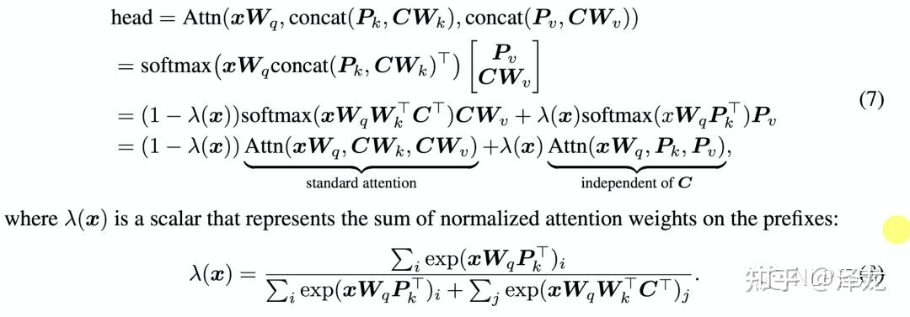
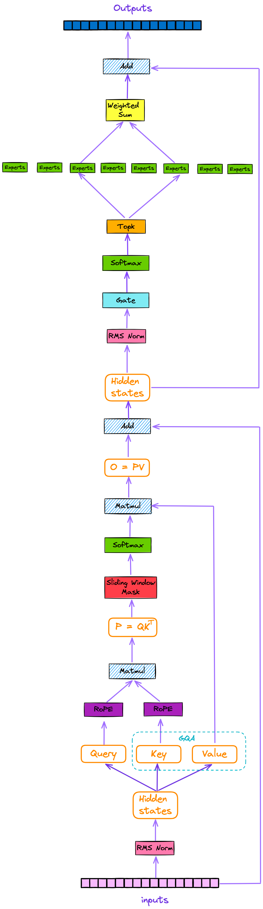

## Prompt

## PosEncoding

具体参考：Transformer/PosEncoding - 再论大模型位置编码及其外推性.html 的【二、正弦编码（Sinusoidal）】

### 内积

内积计算方法

$ \begin{bmatrix} q_1 \ q_2 \ q_3 \end{bmatrix} \begin{bmatrix}
k_{1} \\
k_{2} \\
k_{3} \\
\end{bmatrix} = q_1k_1 + q_2k_2 + q_3k_3
$

如果X向量是横着表示：$ X W_q (X W_k)^T = X W_q W_k^T X $

如果X向量是竖着表示：$ (W_q X)^T W_k X = X^T W_q^T W_k X $

上面两种形式，$ X $ 和 $ X^T $ 都不会挨着，中间还会多一个W矩阵，不能单独看$PE(t) PE(t+k)$

### 正弦位置编码的内积

可以看到，只计算 $PE(t) PE(t+k)$ 时，内积确实只与k有关


### 内积的衰减性

当base选择10000时，距离k在10000以内可以看做远程衰减，超过2w就会增大

```python
k = np.linspace(-20000, 20000, 20000)
d = 768
f = 0
for i in range(0, d, 2):
    w = np.power(1.0 / 10000.0, float(i) / d)
    f += np.cos(k * w)

plt.plot(k, f)
# Show the plot
plt.show()
```


base=200时的曲线


### 实际看看W的影响

前面提到的，在不包含W时，$PE(t) PE(t+k)$ 位置向量的内积只和相对位置 k 有关，且远程衰减.

实际情况是，$PE(t) W_q^T W_k PE(t+k)$，设 $ W = W_q^T W_k $，论文中说乘以W之后就不具备远程衰减性：


<br />

我们来实际计算看一看：


```python
    base = 10000
    mul = 2
    d = 768
    m = 1
    k = np.linspace(-mul * base, mul * base, base // 10)
    f = np.zeros(k.shape, dtype=np.float32)
    np.random.seed(22)
    w = np.random.rand(d, d)

    for index, ki in enumerate(k):
        p1 = np.zeros([d,], dtype=np.float32)
        for i in range(0, d, 2):
            theta = np.power(1.0 / base, float(i) / d)
            p1[i] = np.sin(m * theta)
            p1[i+1] = np.cos(m * theta)
        p2 = np.zeros([d,], dtype=np.float32)
        for i in range(0, d, 2):
            theta = np.power(1.0 / base, float(i) / d)
            p2[i] = np.sin(ki * theta)
            p2[i+1] = np.cos(ki * theta)
        dot_product = p1 @ w @ p2.T
        f[index] = dot_product

    plt.plot(k, f)
    # Show the plot
    plt.show()
```

d=768，base=10000时，还是可以保持远程衰减性

m=1:


m=8000:


当d=128，base=10000时，情况就改变了，当m=8000时基本随机：

m=1:


m=800:


m=8000:


## Fine Tuning

从参数规模的角度，大模型的微调分成两条技术路线：
* 全量微调FFT(Full Fine Tuning)
* PEFT(Parameter-Efficient Fine Tuning)

从训练数据的来源、以及训练的方法的角度，大模型的微调有以下几条技术路线：
* SFT(Supervised Fine Tuning)：监督式微调
* RLHF(Reinforcement Learning with Human Feedback)：基于人类反馈的强化学习微调
* RLAIF(Reinforcement Learning with AI Feedback)：基于AI反馈的强化学习微调

### LoRA(Low Rank Adaption)

前人的一些关于内在维度（intrinsic dimension）的发现：模型是过参数化的，它们有更小的内在维度，模型主要依赖于这个低的内在维度（low intrinsic dimension）去做任务适配。

前人的工作发现预训练的语言模型具有较低的“内部维度（intrinsic dimension）”，在任务适配过程中，即使随机投影到较小的子空间，仍然可以有效地学习。

LoRA的实现思想很简单，如下图所示，就是冻结一个预训练模型的矩阵参数，并选择用A和B矩阵来替代，在下游任务时只更新A和B。


LoRA的实现流程：
* 在原始预训练语言模型（PLM）旁边增加一个旁路，做一个降维再升维的操作，来模拟所谓的内在秩。
* 训练的时候固定PLM的参数，只训练降维矩阵A与升维矩阵B。
* 模型的输入输出维度不变，输出时将BA与PLM的参数叠加。
* 用随机高斯分布初始化A，用0矩阵初始化B，保证训练的开始此旁路矩阵依然是0矩阵。

$ h = W_0 x + \Delta Wx = W_0 x + BAx = (W_0 + BA) x $

$ W_0 \in \mathbb{R}^{d \times k}, B \in \mathbb{R}^{d \times r}, A \in \mathbb{R}^{r \times k} $

For a model like GPT-3, trainable parameters are reduced by 10000 times. This means instead of training 175 billion parameters, if you apply LoRA, you only have 17.5 million trainable parameters.

参考：
* [LoRA](https://zhuanlan.zhihu.com/p/636481171)
* [Mastering Low-Rank Adaptation (LoRA): Enhancing Large Language Models for Efficient Adaptation](https://www.datacamp.com/tutorial/mastering-low-rank-adaptation-lora-enhancing-large-language-models-for-efficient-adaptation)


### Prefix Tuning

Prefix tuning会在每层transformer的多个attention的key跟value向量中插入l个用于更新参数的prefix向量，每个attention的计算公式如下，其中的Pk, Pv就是新插入的prefix向量：



而等式的前半部分是不加入prefix向量的初始attention计算的公式，后半部分则是跟上下文向量C无关的部分，通过一个类似门的机制来计算前后两部分的比重，如果用h表示原本的attention模块输出，那么prefix tuning的attention计算可以写成如下形式，加入prefix的attention模块输出等于原本attention模块输出和一个的与上下文无关的增量之间的加权平均。


## Flash Transformer

从代码实现看：
* 降维生成 Q&K（128），由同一个Z分别与不同向量(gamma scale, beta offset)相乘得到
* 升维生成 V（1536），虽然是为了模仿普通Transformer升维linear变换，但也可以看成得到了更丰富的特征维度
* 当sequence长度n比特征维度d大时，$Q(K^TV)$ 比 $(QK^T)V$ 计算资源开销小，且存储空间小：
  * $(Q_{n \times d}K_{n \times d}^T)V_{n \times d}$：d * n * n 次相乘相加得到attention $A_{n \times n}$，再 n * d * n 次相乘相加得到结果，总计算量为 2 * d * n * n
  * $Q_{n \times d}(K_{n \times d}^TV_{n \times d})$：$KV$ 经过 n * d * d 次相乘相加得到 $D_{d \times d}$，再 d * d * n 次相乘相加得到结果，总计算量为 2 * d * d * n
* Mixed Chunk计算全局attn（linear-attn）时采用了 $Q(K^TV)$ 方式减少计算量，计算局部attn（quad-attn）采用group分组减少计算量(d * n * n -> d * n * n / g = g * d * n/g * n/g)

gau有个缺陷，q、k的维度必须一样

### GAU 结构


伪代码实现：


### Mixed Chunk Attention

`kv = tf.einsum('bgcs,bgce->bse', k, v)` 对分组(维度g)进行了加和，
与 `kv = tf.einsum('bns,bne->bse', k, v)` 完全等价(n=g*c)，<font color=red>因为是沿着矩阵相乘的中间维度分组</font>。

类似的，普通Transformer在计算 $QK^T$ 时，沿着特征维度将dim分组为多个heads，因为是沿着矩阵相乘的中间维度分组，计算得到的多个attention，相加之后等于不分multi heads时的计算结果。但是，multi-heads attention 分别与 multi-heads 后的 $V$(沿着特征维度分为multi-heads)相乘后再concat，这样结果就不一样了


## GTrXL Transformer

Transformer-XL 模型的多层


gtrxl.py代码实现中的u、v、相对位置编码参考下图说明，文章详情参考Transformer目录下的《PosEncoding - XL_T5 - 让研究人员绞尽脑汁的Transformer位置编码 - 科学空间_Scientific Spaces.pdf》


## DINO
teacher-student网络，无监督学习，图像segment结果令人印象深刻

## Mistral

用到了以下几项技术：
* SMoE (Sparse Mixture of Experts)
* SWA (Sliding Window Attention)
* RoPE (Rotary Position Embedding)
* GQA (Grouped-Query Attention)

详情参考：A Detailed Explanation of Mixtral 8x7B Model，讲解得很清晰。

整体结构如下，对原attention输出做了一个gate计算，然后选出top 2结果。



其中gate的参数如下，开销很小

```python
self.gate = nn.Linear(self.hidden_dim, self.num_experts, bias=False)
```

### sliding windows

__transformer model itself is a stacked structure, with higher layers having a wider receptive field compared to lower layers__


实现代码：

```python
@dataclass
class AttentionMaskConverter:

    ...
    ...  

    @staticmethod
    def _make_causal_mask(
        input_ids_shape: torch.Size,
        dtype: torch.dtype,
        device: torch.device,
        past_key_values_length: int = 0,
        sliding_window: Optional[int] = None,
    ):
        """
        Make causal mask used for bi-directional self-attention.
        """
        bsz, tgt_len = input_ids_shape
        mask = torch.full((tgt_len, tgt_len), torch.finfo(dtype).min, device=device)
        mask_cond = torch.arange(mask.size(-1), device=device)
        mask.masked_fill_(mask_cond < (mask_cond + 1).view(mask.size(-1), 1), 0)

        mask = mask.to(dtype)

        if past_key_values_length > 0:
            mask = torch.cat([torch.zeros(tgt_len, past_key_values_length, dtype=dtype, device=device), mask], dim=-1)

        # add lower triangular sliding window mask if necessary
        if sliding_window is not None:
            diagonal = past_key_values_length - sliding_window + 1

            context_mask = 1 - torch.triu(torch.ones_like(mask, dtype=torch.int), diagonal=diagonal)
            mask.masked_fill_(context_mask.bool(), torch.finfo(dtype).min)

        return mask[None, None, :, :].expand(bsz, 1, tgt_len, tgt_len + past_key_values_length)
```

mask.masked_fill_ 生成如下矩阵：

```
tensor([[     0., -65504., -65504., -65504., -65504., -65504.],
        [     0.,      0., -65504., -65504., -65504., -65504.],
        [     0.,      0.,      0., -65504., -65504., -65504.],
        [     0.,      0.,      0.,      0., -65504., -65504.],
        [     0.,      0.,      0.,      0.,      0., -65504.],
        [     0.,      0.,      0.,      0.,      0.,      0.]])
```

与 past_key_values_length cat 后：

```
tensor([[     0.,      0.,      0., -65504., -65504., -65504., -65504., -65504.],
        [     0.,      0.,      0.,      0., -65504., -65504., -65504., -65504.],
        [     0.,      0.,      0.,      0.,      0., -65504., -65504., -65504.],
        [     0.,      0.,      0.,      0.,      0.,      0., -65504., -65504.],
        [     0.,      0.,      0.,      0.,      0.,      0.,      0., -65504.],
        [     0.,      0.,      0.,      0.,      0.,      0.,      0.,      0.]])
```

diagonal 的 context_mask：

```
tensor([[0, 0, 0, 0, 0, 0, 0, 0],
        [0, 0, 0, 0, 0, 0, 0, 0],
        [1, 0, 0, 0, 0, 0, 0, 0],
        [1, 1, 0, 0, 0, 0, 0, 0],
        [1, 1, 1, 0, 0, 0, 0, 0],
        [1, 1, 1, 1, 0, 0, 0, 0]], dtype=torch.int32)
```

与 context_mask mask.masked_fill_ 后：

```
tensor([[     0.,      0.,      0., -65504., -65504., -65504., -65504., -65504.],
        [     0.,      0.,      0.,      0., -65504., -65504., -65504., -65504.],
        [-65504.,      0.,      0.,      0.,      0., -65504., -65504., -65504.],
        [-65504., -65504.,      0.,      0.,      0.,      0., -65504., -65504.],
        [-65504., -65504., -65504.,      0.,      0.,      0.,      0., -65504.],
        [-65504., -65504., -65504., -65504.,      0.,      0.,      0.,      0.]])
```

mask[None, None, :, :] 将 mask 新扩展出0、1维度，shape变为(1, 1, tgt_len, tgt_len + past_key_values_length)

最后 expand(bsz, 1, tgt_len, tgt_len + past_key_values_length)，将mask沿着dim=0重复bsz份


### 训练参数

训练参数（from huggingface https://huggingface.co/mistralai/Mixtral-8x7B-v0.1/blob/main/config.json）：

hidden_size: 就是dim($W_{q,k,v}$矩阵的特征维度，也是token embedding后的vector长度)，intermediate_size：mlp的高维映射dim，max_position_embeddings：输入sequence最大长度

```json
{
  "architectures": [
    "MixtralForCausalLM"
  ],
  "attention_dropout": 0.0,
  "bos_token_id": 1,
  "eos_token_id": 2,
  "hidden_act": "silu",
  "hidden_size": 4096,
  "initializer_range": 0.02,
  "intermediate_size": 14336,
  "max_position_embeddings": 32768,
  "model_type": "mixtral",
  "num_attention_heads": 32,
  "num_experts_per_tok": 2,
  "num_hidden_layers": 32,
  "num_key_value_heads": 8,
  "num_local_experts": 8,
  "output_router_logits": false,
  "rms_norm_eps": 1e-05,
  "rope_theta": 1000000.0,
  "router_aux_loss_coef": 0.02,
  "sliding_window": null,
  "tie_word_embeddings": false,
  "torch_dtype": "bfloat16",
  "transformers_version": "4.36.0.dev0",
  "use_cache": true,
  "vocab_size": 32000
}
```

参数说明：https://huggingface.co/docs/transformers/main/model_doc/mistral#transformers.MistralConfig.vocab_size

* hidden_size (int, optional, defaults to 4096) — Dimension of the hidden representations.
* intermediate_size (int, optional, defaults to 14336) — Dimension of the MLP representations.
* num_hidden_layers (int, optional, defaults to 32) — Number of hidden layers in the Transformer encoder.
* max_position_embeddings (int, optional, defaults to 4096*32) — The maximum sequence length that this model might ever be used with. Mistral’s sliding window attention allows sequence of up to 4096*32 tokens.
* sliding_window (int, optional, defaults to 4096) — Sliding window attention window size. If not specified, will default to 4096.

### 实用操作
https://huggingface.co/docs/transformers/main/model_doc/mistral#model-details

| Model Name             | Checkpoint           |
|------------------------|----------------------|
| Mistral-7B-v0.1        | [Raw Checkpoint](https://files.mistral-7b-v0-1.mistral.ai/mistral-7B-v0.1.tar)       |
| Mistral-7B-Instruct-v0.1 | [Raw Checkpoint](https://files.mistral-7b-v0-1.mistral.ai/mistral-7B-instruct-v0.1.tar)     |


```python
python src/transformers/models/mistral/convert_mistral_weights_to_hf.py \
    --input_dir /path/to/downloaded/mistral/weights --model_size 7B --output_dir /output/path
```

### 参考（本地也有保存）：
* 结构、代码实现 [A Detailed Explanation of Mixtral 8x7B Model](https://pub.towardsai.net/a-detailed-explanation-of-mixtral-8x7b-model-eabf27dbaaf4)
* 运行、微调 [Mistral - Mistral 7B Tutorial](https://www.datacamp.com/tutorial/mistral-7b-tutorial)
* 实现源码 [mistral src codes](https://github.com/mistralai/mistral-src)

