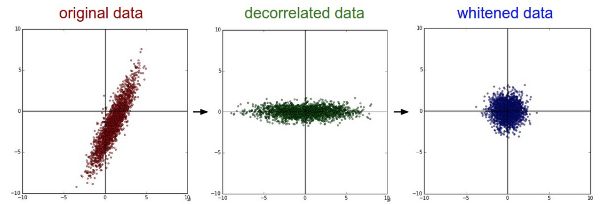

#Whitening

##PCA Whitening
$X_{m\times n}$，协方差矩阵$S$，$V$特征向量矩阵，$\lambda$特征值矩阵
$$
\begin{aligned}
& S={1\over m}X^TX=V\lambda V^T \\
& X\_{rot}=XV \\
& X\_{white}=X\_{rot} \Sigma^{-1} \\
& {1\over m}X\_{white}^T \cdot X\_{white}=I
\end{aligned}
$$
其中：
$$
\Sigma^{-1}=
\begin{bmatrix}
{1\over \sigma_1} & 0 & \cdots & 0 \\
0 & {1\over \sigma_2} & \cdots & 0 \\
\vdots & \vdots & \ddots & \vdots \\
0 & 0 & \cdots & {1\over \sigma_n}
\end{bmatrix}，
\sigma_i=\sqrt \lambda_i
$$

示例：
$$
x\_{white}^{(i)}=
\begin{bmatrix}
{x\_{rot}^{(i)}_1 \over \sigma_1} & {x\_{rot}^{(i)}_2 \over \sigma_2} & \cdots & {x\_{rot}^{(i)}_n \over \sigma_n}
\end{bmatrix}
$$

令$X\_{white}$第$i$列为$u_i$，则方差${1 \over m}u_i^Tu_i=1$，协方差${1\over m}u_i^Tu_j=0\left( i\ne j\right)$，$\left\{u_1,u_2,\cdots,u_n\right\}$是一组正交基（模长$\sqrt m$）

##ZCA Whitening
如果$ RR^T=R^TR=I $，令$Y=X\_{white} \cdot R$，则
$${1\over m}Y^TY=R^T{X\_white^TX\_white \over m} R=I$$

特别的令$R＝V^T$，则
$$
X\_zcawhite=X\_white V^T
$$

##求解1
$$
[U,\lambda,V] = svd(S)
$$

对$S$进行svd分解得到的奇异值等于$\lambda$，证明如下：
$$
\begin{aligned}
S^TS & =V\lambda^T V^TV\lambda V^T \\
& = V \lambda^T I \lambda V^T \\
& = V \left(\lambda \lambda\right) V^T
\end{aligned}
$$

$S$的奇异值为$S^TS$的特征值的平方根，即$\sqrt{\lambda\lambda}=\lambda$

可以看到，对$X$的协方差矩阵进行svd分解，可一次得到变换矩阵$V$和$S$的特征值$\lambda$

##求解2
$$ [U,\sigma,V^T] = svd(X) $$
直接对$X$ svd分解，得到变换矩阵$V$和奇异值$\sigma$，${1 \over \sqrt m}\sigma$即求解1中的$\sqrt \lambda$

