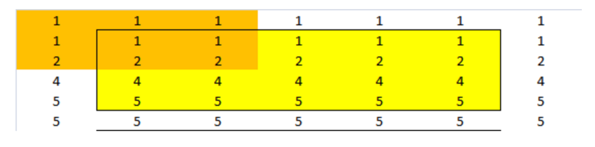
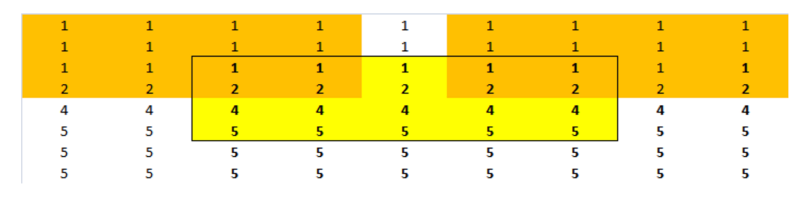

```
vector = np.array([
[1.0,1.0,1.0,1.0,1.0],
[2.0,2.0,2.0,2.0,2.0],
[4.0,4.0,4.0,4.0,4.0],
[5.0,5.0,5.0,5.0,5.0]])

filtered = uniform_filter(vector, 3, mode='reflect')

array([[ 1.33333333,  1.33333333,  1.33333333,  1.33333333,  1.33333333],
       [ 2.33333333,  2.33333333,  2.33333333,  2.33333333,  2.33333333],
       [ 3.66666667,  3.66666667,  3.66666667,  3.66666667,  3.66666667],
       [ 4.66666667,  4.66666667,  4.66666667,  4.66666667,  4.66666667]])
```


    mode       |   Ext   |         Input          |   Ext
    -----------+---------+------------------------+---------
    'mirror'   | 4  3  2 | 1  2  3  4  5  6  7  8 | 7  6  5
    'reflect'  | 3  2  1 | 1  2  3  4  5  6  7  8 | 8  7  6
    'nearest'  | 1  1  1 | 1  2  3  4  5  6  7  8 | 8  8  8
    'constant' | 0  0  0 | 1  2  3  4  5  6  7  8 | 0  0  0
    'wrap'     | 6  7  8 | 1  2  3  4  5  6  7  8 | 1  2  3





