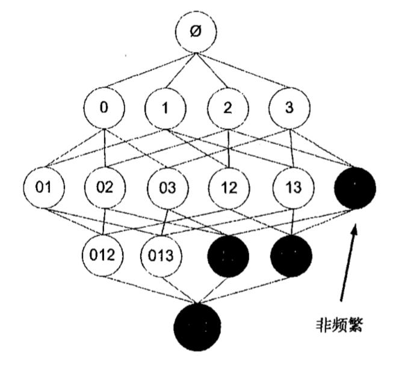

##决策树
###ID3（Iterative Dichotomiser 3 迭代二叉树3）

贪心法，每次选取使熵降低最多的数据集分割

##回归树
###CART（classification and regression tree分类回归树）
误差计算：集合的方差＊集合数据个数 
叶节点设为常数值：集合平均值 
问题：树节点过多容易过拟合 

#### *预剪枝*

限制叶节点数据数量>n，限制集合划分误差减少值>$\epsilon$，都属于预剪枝

#### *后剪枝*

将数据集分成测试集和训练集，找叶节点，用测试集判断将这些叶节点合并能否降低测试误差，如果是就合并

###模型树
更易于理解，两条直线比很多节点组成一棵大树更容易解释 
叶节点设为常数值：线性回归参数w,b等 

树回归方法在预测复杂数据时会比简单的线性模型更有效

##关联分析
frequent pattern：频繁项集

支持度（support）：数据集中包含该项集的记录所占的比例 
可信度或置信度（confidence）：针对一条诸如{尿布} $\rightarrow$ {葡萄酒}的关联规则来定义，${support(尿布,葡萄酒) \over support(尿布)}$

###Apriori(一个先验)算法
如果一个项集是非频繁集，那么它的所有超集也是非频繁集

如果$0,1,2 \to 3$低可信，那么所有右部包含3的都是低可信，且越往下层越不可信

###FP-growth算法

##贝叶斯分类
$$
p(c|x)={p(x\ and\ c) \over p(x)}={p(x|c)p(c) \over p(x)} \\
p(c|x)p(x)=p(x|c)p(c)
$$

朴素贝叶斯：1.一个特征或者单词出现的可能性与它和其他单词相邻没有关系，2.每个特征同等重要

为防止概率连乘后数据太小下溢，可以对乘积取自然对数

###应用
前面介绍了朴素贝叶斯的两个实际应用的例子,第一个 例子是过滤网站的恶意留言,第二个是过滤垃圾邮件。分类还有大量的其他应用。我曾经见过有 人使用朴素贝叶斯从他喜欢及不喜欢的女性的社交网络档案学习相应的分类器,然后利用该分类 器测试他是否会喜欢一个陌生女人。分类的可能应用确实有很多,比如有证据表示,人的年龄越大，他所用的词也越好，那么,可以基于一个人的用词来推测他的年龄。

在这个最后的例子当中,我们将分别从美国的两个城市中选取一些人,通过分析这些人发布的 征婚广告信息,来比较这两个城市的人们在广告用词上是否不同。如果结论确实是不同,那么他们 各自常用的词是哪些?从人们的用词当中,我们能否对不同城市的人所关心的内容有所了解

##SVM支持向量机
$$
\max{1\over \|\omega\|}\ \ s.t.,y_i\left(\omega^Tx_i+b\right) \ge 1,i=i,2,\cdots,m
$$
等价于
$$
\min {1\over 2}\|\omega\|^2\ \ s.t.,y_i\left(\omega^Tx_i+b\right) \ge 1,i=i,2,\cdots,m
$$

###拉格朗日对偶
拉格朗日乘子（Lagrange multiplier）$\alpha$
$$
\mathcal{L}(\omega,b,\alpha)={1\over 2}\|\omega\|^2-\sum_{i=1}^m \alpha_i \left( y_i \left( \omega^Tx_i+b \right)-1 \right) \tag1 \\
\min_{\omega,b} \max_{\alpha} \mathcal{L}(\omega,b,\alpha) \le \max_{\alpha} \min_{\omega,b} \mathcal{L}(\omega,b,\alpha)
$$

1. 求$min$
$$
\begin{align}
& {\partial \mathcal{L} \over \partial \omega}=0 \implies \omega=\sum_{i=1}^m \alpha_i y_i x_i \\
& {\partial \mathcal{L} \over \partial b}=0 \implies \sum_{i=1}^m \alpha_i y_i =0
\end{align}
$$
代入$(1)$式得
$$
\mathcal{L}(\omega,b,\alpha)={1\over 2} \sum_{i,j=1}^m \alpha_i \alpha_j y_i y_j x_i^T x_j - \sum_{i,j=1}^m \alpha_i \alpha_j y_i y_j x_i^T x_j - b\sum_{i=1}^m \alpha_i y_i + \sum_{i=1}^m \alpha_i
$$
$$
\mathcal{L}(\omega,b,\alpha) = \sum_{i=1}^m \alpha_i - {1\over 2}\sum_{i,j=1}^m \alpha_i \alpha_j y_i y_j x_i^T x_j \tag2
$$

2. 求$max$
$$
\max_\alpha \left( \sum_{i=1}^m \alpha_i - {1\over 2}\sum_{i,j=1}^m \alpha_i \alpha_j y_i y_j x_i^T x_j \right) \\
s.t., \alpha_i \ge 0, i=1,2,\cdots,m \\
\sum_{i=1}^m \alpha_i y_i=0
$$

###分类函数
$$
\begin{align}
f(x)&=\left( \sum_{i=1}^m \alpha_i y_i x_i \right)^T x + b \\
&=\sum_{i=1}^m \alpha_i y_i \langle x_i,x\rangle + b \tag3 \\
\end{align}
$$

###松弛变量版本
$$
求\min{1\over 2}\|\omega\|^2 + \color{maroon}{ C\sum_{i=1}^m \xi_i } \\
s.t.,y_i(\omega^Tx_i+b) \ge 1-\color{maroon}{\xi_i},i=1,2,\cdots,m
$$
其中$\xi_i \ge 0$，称为松弛变量，新的拉格朗日函数为：
$$
\mathcal{L}(\omega,b,\xi,\alpha,r)={1\over 2}\|\omega\|^2 + \color{maroon}{ C\sum_{i=1}^m\xi_i } - \sum_{i=1}^m\alpha_i\left( y_i\left( \omega^Tx_i+b \right) -1+ \color{maroon}{\xi_i} \right) - \color{maroon}{ \sum_{i=1}^mr_i\xi_i }
\tag{1a}$$
和之前一样，让$\mathcal{L}$针对$\omega、b、\xi$最小化：
$$
\begin{align}
& {\partial \mathcal{L} \over \partial \omega}=0 \implies \omega=\sum_{i=1}^m \alpha_i y_i x_i \\
& {\partial \mathcal{L} \over \partial b}=0 \implies \sum_{i=1}^m \alpha_i y_i =0 \\
& {\partial \mathcal{L} \over \partial \xi_i}=0 \implies C-\alpha_i-r_i=0，i=1,2,\cdots,m
\end{align}
$$
由于$r_i \ge 0$，于是$\alpha_i \le C$，拉格朗日对偶问题变成：
$$
\max_\alpha \left( \sum_{i=1}^m \alpha_i - {1\over 2}\sum_{i,j=1}^m \alpha_i \alpha_j y_i y_j x_i^T x_j \right) \\
s.t., 0 \le \alpha_i \le C, i=1,2,\cdots,m \\
\sum_{i=1}^m \alpha_i y_i=0
$$

###SMO(Sequential Minimal Optimization)算法

$$
\min_\alpha \Psi(\alpha)=\min_\alpha{1\over 2}\sum_{i,j=1}^m \alpha_i \alpha_j y_i y_j K(x_i,x_j) - \sum_{i=1}^m \alpha_i
$$

**1. 计算$u_1,u_2$**
$$
u=\omega^* x+b^* = \sum_{i=1}^m \alpha^*_i y_i x_i^T x +b^* \\
u_1= \sum_{i=1}^m \alpha_i^* y_i K_{1i} +b^* \\
u_2= \sum_{i=1}^m \alpha_i^* y_i K_{2i} +b^*
$$

**2. 求$\alpha$，以$\alpha_1,\alpha_2$为变量，固定其他$\alpha$**
$$
\Psi={1\over 2}K_{11}\alpha_1^2 + {1\over 2}K_{22}\alpha_2^2 + sK_{12} \alpha_1 \alpha_2 + y_1 \alpha_1 v_1 + y_2 \alpha_2 v_2 - \alpha_1 - \alpha_2 + \Psi_{constant}
$$

其中
$$
\begin{align}
s&=y_1 y_2 \\
K_{ij} &= K(x_i,x_j) \\
v_i &= \sum_{j=3}^m y_i \alpha_i^* K_{ij}=u_i-b^*-y_1\alpha_1^*K_{1i}-y_2\alpha_2^*K_{2i} (v_i是常量，由\alpha^*确定)
\end{align}
$$

令$\alpha_1 y_1 + \alpha_2 y_2=\zeta$，两边乘以$y_1$得，
$$
\alpha_1 + s\alpha_2=y_1\zeta=\phi \\
\alpha_1 = \phi - s \alpha_2 \\
\Psi={1\over 2}K_{11}(\phi - s \alpha_2)^2 + {1\over 2}K_{22}\alpha_2^2 + sK_{12} (\phi - s \alpha_2) \alpha_2 + y_1 (\phi - s \alpha_2) v_1 + y_2 \alpha_2 v_2 \\
- (\phi - s \alpha_2) - \alpha_2 + \Psi_{constant}
$$

令${\partial \Psi \over \partial \alpha_2}=0$得，
$$
-sK_{11}(\phi-s\alpha_2) + K_{22}\alpha_2 + sK_{12}\phi - 2K_{12}\alpha_2 - y_1sv_1 + y_2v_2 + s - 1 =0 \\
-sK_{11}(\phi-s\alpha_2) + K_{22}\alpha_2 + sK_{12}\phi - 2K_{12}\alpha_2 - y_2v_1 + y_2v_2 + s - 1 =0
$$

$$
\alpha_2(K_{11}+K_{22}-2K{12})=s(K_{11} -K_{12})\phi +y_2(v_1-v_2) +1-s
$$

将$\phi=\alpha^*_1+s\alpha^*_2，s=y_1y_2，v_1，v_2$代入等号右边，
$$
\alpha_2(K_{11}+K_{22}-2K_{12})=y_1y_2(K_{11} -K_{12})(\alpha^*_1+y_1y_2\alpha^*_2) + 1-y_1y_2\\
+y_2(u_1-u_2-y_1\alpha^*_1K_{11}-y_2\alpha^*_2K_{12} +y_1\alpha^*_1K_{12} +y_2\alpha^*_2K_{22}) \\
=\alpha^*_1(y_1y_2K_{11}-y_1y_2K_{12}-y_1y_2K_{11}+y_1y_2K_{12}) + \alpha^*_2(K_{11}-K_{12}-K_{12}+K_{22}) \\
+ 1-y_1y_2 + y_2(u_1-u_2) \\
= \alpha^*_10 + \alpha^*_2(K_{11}-2K_{12}+K_{22}) + y_2(u_1-u_2+y_2-y_1) \\
= \alpha^*_2(K_{11}-2K_{12}+K_{22})+y_2(u_1-u_2+y_2-y_1)
$$

最终，
$$
\alpha_2(K_{11}-2K_{12}+K_{22}) = \alpha^*_2(K_{11}-2K_{12}+K_{22})+y_2(u_1-u_2+y_2-y_1)
$$
令$E_i=u_i-y_i$（预测值与真实值之差），$\eta=K_{11}-2K_{12}+K_{22}$得
$$
\alpha_2=\alpha^*_2 + {y_2(E_1-E_2) \over \eta} \tag4
$$
$$
\alpha_1=\alpha^*_1 + y_1y_2(\alpha^*_2-\alpha_2) \tag5
$$

求出的$\alpha_1,\alpha_2$都要满足$0 \le \alpha \le C$

* $y_1,y_2$符号不同时：
$\alpha_1y_1+\alpha_2y_2=\zeta$，
$\alpha_1-\alpha_2=\zeta$
$$\alpha_2范围
\begin{cases}
L = \max(0,-\zeta) \\
H = \min(C,C-\zeta)
\end{cases}
$$

* $y_1,y_2$符号相同时：
$\alpha_1y_1+\alpha_2y_2=\zeta$，
$\alpha_1+\alpha_2=\zeta$
$$\alpha_2范围
\begin{cases}
L = \max(0,\zeta-C) \\
H = \min(C,\zeta)
\end{cases}
$$

$$\alpha_2=
\begin{cases}
H, &\alpha_2>H \\
\alpha_2, &L \le \alpha_2 \le H \\
L, &\alpha_2<L
\end{cases}
\tag6 $$

**3. 求b**
$$
u_1=\omega^*x_1+b^* \\
y_1=\omega x_1+b_1 \\
E_1=u_1-y_1=\alpha^*_1y_1K_{11}+\alpha^*_2y_2K_{12}-\alpha_1y_1K_{11}-\alpha_2y_2K_{12} +b^*-b_1 \\
E_1+b_1-b^*=y_1K_{11}(\alpha^*_1-\alpha_1) + y_2K_{12}(\alpha^*_2-\alpha_2) \\
$$
$$
b_1=b^*-E_1 - y_1K_{11}(\alpha_1-\alpha^*_1) - y_2K_{12}(\alpha_2-\alpha^*_2) \tag7
$$
$$
b_2=b^*-E_2 - y_1K_{12}(\alpha_1-\alpha^*_1) - y_2K_{22}(\alpha_2-\alpha^*_2) \tag8
$$

$$
b=\begin{cases}
b_1 & if\ 0<\alpha_1<C \\
b_2 & if\ 0<\alpha_2<C \\
{{1\over 2}(b_1+b_2)} & otherwise
\end{cases} \tag9
$$

####如何选$\alpha_1,\alpha_2$
Select some pair $\alpha_i$ and $\alpha_j$ to update (using a heuristic that tries to pick the two that will allow us to make the biggest progress towards the global maximum)

1. 先“扫描”所有乘子，把第一个违反KKT条件的作为更新对象，令为$\alpha_1$；
2. 在所有不违反KKT条件的乘子中，选择使$|E_1 −E_2|$最大的$\alpha_2$进行更新

###核函数
**径向基核函数（高斯核函数）**：
$$\mathcal{K}(x_1,x_2)=exp\left({{-\|x_1-x_2\|^2 \over {2\sigma^2}}}\right)$$
$\sigma$到达率，函数跌落到0的速度参数

##SVM支持向量机——损失函数形式
$$
L=\underbrace{ {1\over m}\sum_{i=1}^m \max\left(0, 1-y_i\omega^T x_i \right) }_{\text{数据损失}} + \underbrace{ \lambda \|\omega\|_2^2 }_{\text{正则损失}}, 其中y_i \in \{-1,1\}
$$
式子前一部分数据损失确保数据样本被正确分类；后一部分正则损失确保$\omega$更小更分散、泛化，鼓励分类器最终将所有维度上的特征都用起来，而不是强烈依赖其中少数几个维度，同时使得SVM获得最大边界

更多参考[https://zhuanlan.zhihu.com/p/20945670?refer=intelligentunit](https://zhuanlan.zhihu.com/p/20945670?refer=intelligentunit)

###多分类SVM——损失函数
$$
\begin{align}
L_i&=\sum_{j\ne y_i} \max(0, \omega_j^T x_i - \omega_{y_i}^T x_i + \Delta) \\
L&={1\over m}\sum_{i=1}^m L_i + \lambda \|\omega\|_2^2 \\
L&={1\over m}\sum_{i=1}^m \sum_{j\ne y_i} \max\left(0, \omega_j^Tx_i - \omega_{y_i}^T x_i + \Delta \right) + \lambda \|\omega\|_2^2
\end{align}
$$

举个例子，对第$i$个数据样本$x_i$的分类预测值假设为$s=\omega x_i=[13,-7,11]$，$\Delta=10$，正确类别$y_i=0$
$$
L_i = \max(0,-7-13+10)+\max(0,11-13+10)=0+8
$$

正确分类的得分13与分为第1类的得分-7的差为20，高于边界值10，说明与第1类距离很远，相当于归类成非第1类，分类ok，因此损失值为0

正确分类的得分13与分为第2类的得分11的差为2，低于边界值10，非常接近，未能将第2类与第0类距离拉大，因此需要计算损失

损失函数鼓励正确分类的分值比其他分类的分值高出至少一个边界值

###多分类SVM损失函数梯度
$$
\nabla_{\omega_{y_i}}L_i=-x_i^T \left( \sum_{j\ne y_i} 1\left(\omega_j^Tx_i-\omega_{y_i}^Tx_i+\Delta>0 \right)\right) + 2\lambda\omega_{y_i} \\
\nabla_{\omega_j}L_i=x_i^T 1\left(\omega_j^Tx_i-\omega_{y_i}^Tx_i+\Delta>0 \right) + 2\lambda\omega_{j}
$$
其中，$1(\cdot)$是示性函数，取值规则为：$1(表达式为真)=1，1(表达式为假)=0$

##AdaBoost
当做重要决定时,大家可能都会考虑吸取多个专家而不只是一个人的意见。机器学习处理问题时又何尝不是如此?这就是元算法(meta-algorithm)背后的思路。

元算法是对其他算法进行组合的一种方式。

**非均衡问题**：信用卡使用中的欺诈检测就是非均衡问题中的一个极好的例子。

基本思想：使用多个弱分类器构建一个强分类器，弱分类器错误率略高于50%，比随机猜测略好。

###Adaboost训练步骤
1. 为训练数据中的每一个样本赋予一个权重$D_i$，构成权重向量D，初始化时权重赋成等值
2. 每次训练出一个弱分类器（比如基于单层决策树，求分类误差最小时选取的特征及特征数值），计算出该分类器的错误率$\varepsilon$，预测向量$classEst$
3. 根据下面公式计算出该分类器预测权重$\alpha$
4. 根据下面公式更新权重D，使得正确分类样本权重降低，错误分类样本权重升高
5. 更新累积预测向量$aggClassEst$，并计算出累积错误率$aggErrorRate$
6. 重复2、3、4、5步骤，直至达到分类器数量上限或者$aggErrorRate$等于0

$$
\begin{align}
& \varepsilon={未正确分类的样本数目 \over 所有样本数目} \tag1 \\
\\
& \alpha={1\over 2}ln \left( {1-\varepsilon \over \varepsilon} \right) \tag2 \\
\\
& D_i^{(k+1)}=\begin{cases}
{D_i^{(k)}e^{-\alpha} \over \sum_{i=1}^m D_i^{(k+1)} } & 样本被正确分类 \\
{D_i^{(k)}e^{\alpha} \over \sum_{i=1}^m D_i^{(k+1)} } & 样本被错误分类
\end{cases} \tag3
\\
\\
& aggClassEst^{(i+1)}=aggClassEst^{(i)}+ \alpha \cdot classEst \tag4 \\
\\
& aggErrorRate^{(i+1)}={aggClassEst^{(i+1)}预测错误样本数目 \over 所有样本数目} \tag5 \\
\end{align}
$$

如下图所示，左边数据集直方图的不同宽度表示每个样本的不同权重，经过一个分类器分类之后，预测结果通过三角形中的$\alpha$值进行加权，最后再求和，得出最终预测向量$aggClassEst$

