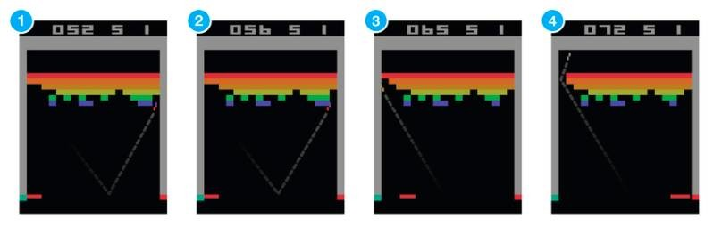

## 什么是强化学习(RL)

强化学习其实也是机器学习的一个分支，在一系列的情景之下，通过多步恰当的决策来达到一个目标，是一种__序列多步决策__的问题。通过控制某个环境下自主行动的个体（autonomous agent），通过和环境之间的互动，不断改进它的行为。

举一个周志华老师在《机器学习》中种西瓜的例子：

>种瓜操作：选种，定期浇水，施肥，除草，杀虫...最后收获西瓜之后，才知道种的瓜好不好。在种瓜过程中执行的某个操作时，并不能立即获得这个操作能不能获得好瓜，仅能得到一个当前的反馈，比如瓜苗看起来更健壮了。需要多次种瓜，不断摸索，才能总结一个好的种瓜策略。以后就用这个策略去种瓜。

摸索这个策略的过程，实际上就是强化学习

<!--img src="img/吃豆人.gif" /-->

### 与传统机器学习的区别

- 强化学习的数据是序列的、交互的、有反馈的
- 不能立即得到标记，而只能得到一个__稀疏(sparse)的、延迟(time-delayed)的__奖励
- 强化学习是一个决策模型，监督学习更偏向模式挖掘、低阶的函数逼近与泛华

强化学习是一种__标记延迟的监督学习__，强化学习的目标就是要寻找一个能使得我们获得最大累积奖赏的策略

- 更有挑战：击碎了一个砖块并拿到分数时，与你在刚刚拿到分数之前的动作（拍子移动）并没有关系
- 一旦你找到了能够获得一定分数的奖励的策略，那么你会坚持它，还是去用可能带来更大的奖励的动作来实验？

强化学习是一个关于我们（以及所有广义上的动物）如何学习的重要模型，只有这种学习方法才考虑到自主个体、环境、奖励等因素

强化学习的领导研究者 Richard Sutton 认为强化学习是人工智能中最 top-level 的 architecture，其他人工智能的子系统，例如 logic 或 pattern recognition，都应该在它的控制之下

## 强化学习(RL)的基本组成

- agent：与环境交互的智能体、自主行动的个体

输入：

- 状态 (States) = 环境，例如迷宫的每一格是一个 state
- 动作 (Actions) = 在每个状态下，有什么行动是容许的
- 奖励 (Rewards) = 进入每个状态时，能带来正面或负面的价值

输出：

- 策略 (Policy) = 在每个状态下，你会选择哪个行动？

### 打砖块游戏

- 输入：屏幕图片像素
- 输出：动作，向左或向右

可以直接录下专业玩家的游戏视频，但是这并不是我们学习的方式。我们不需要其他人无数次地告诉我们该在每个画面上选择怎样的动作。我们只需要做出对的决策后的几次反馈，然后就可以自己解决了。

$$
Q(s,a)=Q(s,a)+\alpha(r + \gamma max_{a'} Q(s',a') - Q(s,a))
$$

$$
Q(s,a)=Q(s,a)+\alpha(r + \gamma Q(s',a') - Q(s,a))
$$

## policy gradient

参考：https://zhuanlan.zhihu.com/p/88957947 （本地[策略梯度 Policy Gradient - 知乎](<../神经网络/RL/策略梯度 Policy Gradient - 知乎.html>)）

注意，文章中 $\nabla_\theta J(\theta)$公式等号右边漏了一个对 $ log \pi_\theta $的求导

正确应该是：

$
\nabla_\theta J(\theta) = \frac{1}{N} \sum_{i=1}^{N} [(\sum_{t=1}^T \nabla_\theta log \pi_\theta (a_{i,t}|s_{i,t})) (\sum_{t=1}^T r(s_t, a_t))]
$

### 关于Variance 方差 的理解：
Q(s,a1)得10分，Q(s,a2)得5分，a1、a2都会正向推动，但a1推得更厉害，使得a1的概率比a2大，但这样梯度会越变越小收敛效率降低；

### 因果性
当对某一时刻策略 $\pi_\theta(s_t,a_t) $ 梯度更新时，赋予它的权重改为时刻t及之后的reward之和 $ \sum r_{t:} $，而不是整条轨迹的reward之和，相当于权重减少 $ \sum r_{1:t-1} $

也很好理解，相当于t时刻之后的所有 Q(s,a) 全部减少了一个固定值，减少了一个固定偏置

### discount_reward及normalization
具体实现：karpathy.pong.py 和 policy_gradient.py。

注意，对pong这个游戏，discount_reward()在每一回合结束时都对累计reward置0，这么做相当于将round当做episode，可以有效增大样本数，样本越多平均得分期望才有效

得分-1序列，前半部分数值变为大于0，会得到鼓励，如何理解？
关键字：相对。Q(s,a1)虽然增大了a1的logits，但如果s状态有另一个a2，Q(s,a2)对a2的logits增加得更多，这样相对而言a1概率是降低的。

__discount_reward 和 normalization 要合在一起用。__

考虑以下数据：

1. 第一轮走了10步，得分-1分，discount rewards为 [-0.91, ..., -1]；
2. 第二轮走了20步，得分-1分，discount rewards为 [-0.826, ..., -1]；

1的平均值比2的平均值小，normalization之后2的高度更高，相对于1，2的前面步骤获得更多鼓励，相当于鼓励了steps数更多的策略，实际训练过程印证了这一点。

再考虑以下数据：一个episode 20次得分-1，1次得分1，normalization之后得分1的序列会被推高很多，意味着这次稀缺的得分1策略会被更多强化

